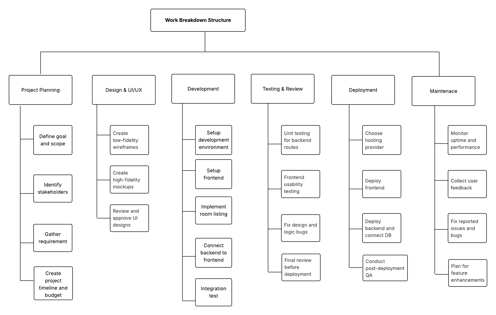

# 📦 Work Breakdown Structure (WBS)
## 🏠 Project: Room Rental Website

---

### Level 1: Project Phases

1. Project Planning
2. Design & UI/UX
3. Development
4. Testing & Review
5. Deployment
6. Maintenance

---

### Level 2 & 3: Deliverables and Tasks

#### 1. Project Planning
- 1.1 Define goals and scope
- 1.2 Identify stakeholders
- 1.3 Gather requirements (room info, images, dimensions, etc.)
- 1.4 Create project timeline and budget

#### 2. Design & UI/UX
- 2.1 Create low-fidelity wireframes (homepage, room list, detail page)
- 2.2 Define style guide (colors, fonts, layout system)
- 2.3 Create high-fidelity mockups
- 2.4 Review and approve UI designs

#### 3. Development
- 3.1 Set up development environment (Node.js, Express, HTML/CSS/JS)
- 3.2 Frontend:
  - 3.2.1 Homepage layout
  - 3.2.2 Room listing page
  - 3.2.3 Room detail page
- 3.3 Backend:
  - 3.3.1 Create Express server
  - 3.3.2 Set up routes and controllers
  - 3.3.3 Connect to database (rooms info, images)
- 3.4 Implement image gallery and room data rendering
- 3.5 Test frontend-backend integration

#### 4. Testing & Review
- 4.1 Unit testing for backend routes
- 4.2 Frontend usability testing
- 4.3 Fix design and logic bugs
- 4.4 Final review before deployment

#### 5. Deployment
- 5.1 Choose hosting provider (e.g., Render, Vercel)
- 5.2 Deploy frontend
- 5.3 Deploy backend and connect DB
- 5.4 Conduct post-deployment QA

#### 6. Maintenance
- 6.1 Monitor uptime and performance
- 6.2 Collect user feedback
- 6.3 Fix reported issues and bugs
- 6.4 Plan for feature enhancements

---

### 📄 WBS Rationale

This WBS follows a logical website development lifecycle with clear phase separation. Planning lays the groundwork for stakeholder alignment. Design tasks ensure the UI is approved before development begins. Development is split into front and back-end deliverables. Testing captures quality assurance before launch. Post-deployment, the project includes ongoing monitoring and iteration. This structure assumes a solo or small team with an expected 4–6 week timeline.

